# Sơ đồ kỹ thuật cho Báo cáo ĐACN

Các sơ đồ dưới đây có thể render bằng Mermaid Live Editor (https://mermaid.live) hoặc các công cụ hỗ trợ Mermaid.

---

## 1. Quy trình ASR truyền thống (Chapter 2 - fig:asr_pipeline)

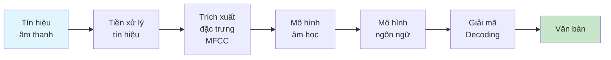

---

## 2. Kiến trúc Transformer (Chapter 2 - fig:transformer_architectures)

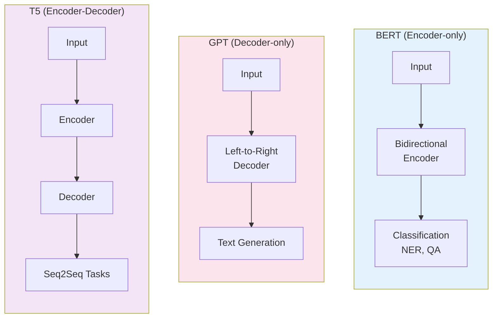

---

## 3. Kiến trúc RAG cơ bản (Chapter 2 - fig:rag_architecture)

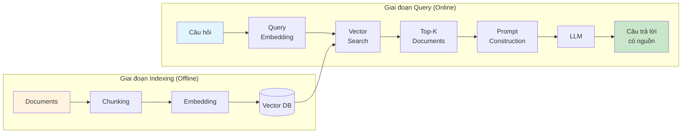

---

## 4. Không gian Embedding (Chapter 2 - fig:embedding_space)

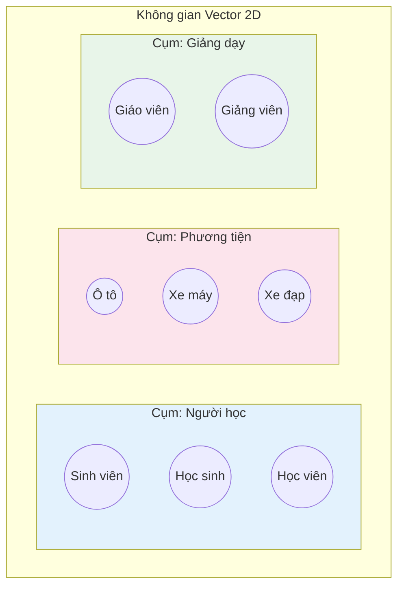

---

## 5. So sánh phương pháp Chunking (Chapter 2 - fig:chunking_methods)

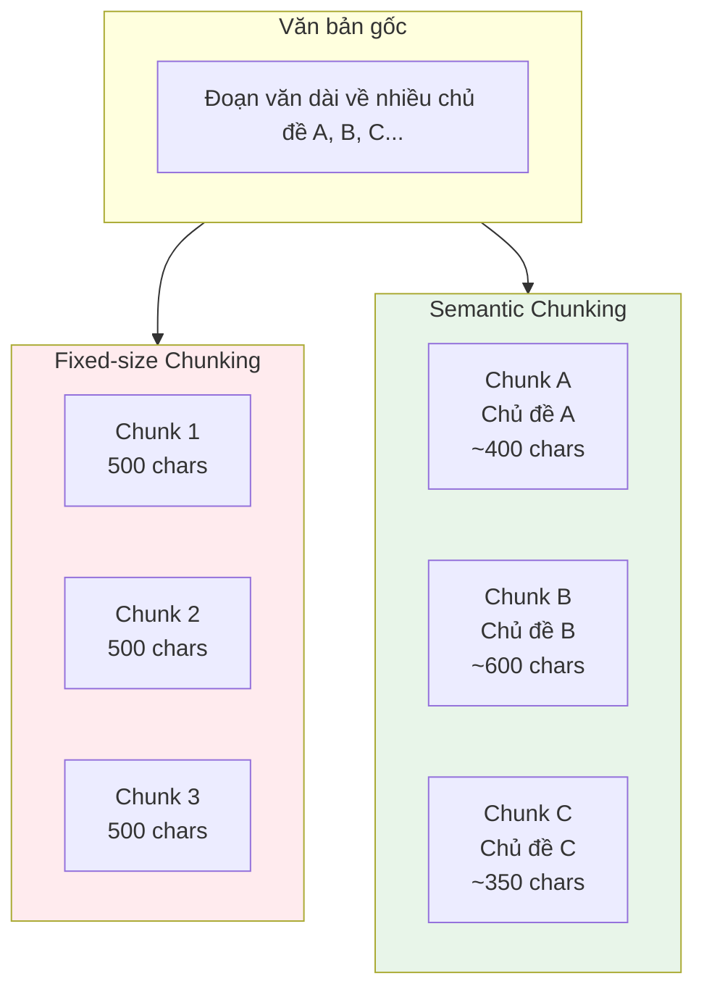

---

## 6. Kiến trúc tổng thể hệ thống (Chapter 4 - fig:system_architecture)

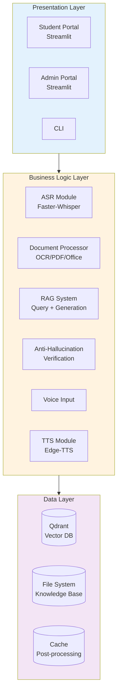

---

## 7. Pipeline Processing - Bước 1 (Chapter 4 - fig:processing_pipeline)

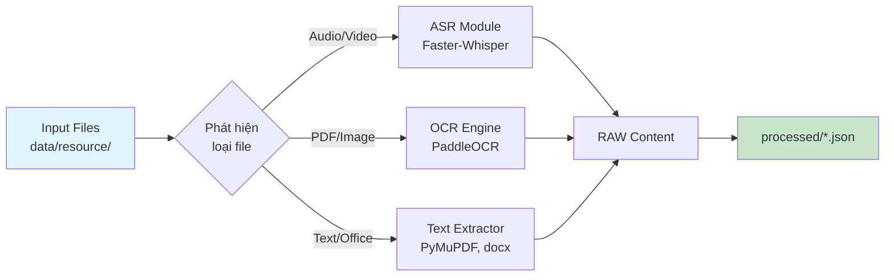

---

## 8. Pipeline Indexing - Bước 2 (Chapter 4 - fig:indexing_pipeline)

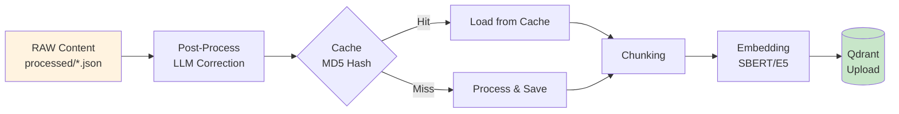

---

## 9. Query Pipeline (Chapter 4 - fig:query_pipeline)

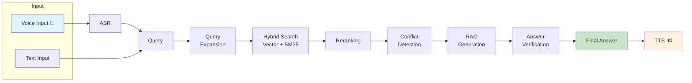

---

## 10. ASR Module Class Diagram (Chapter 4 - fig:asr_class)

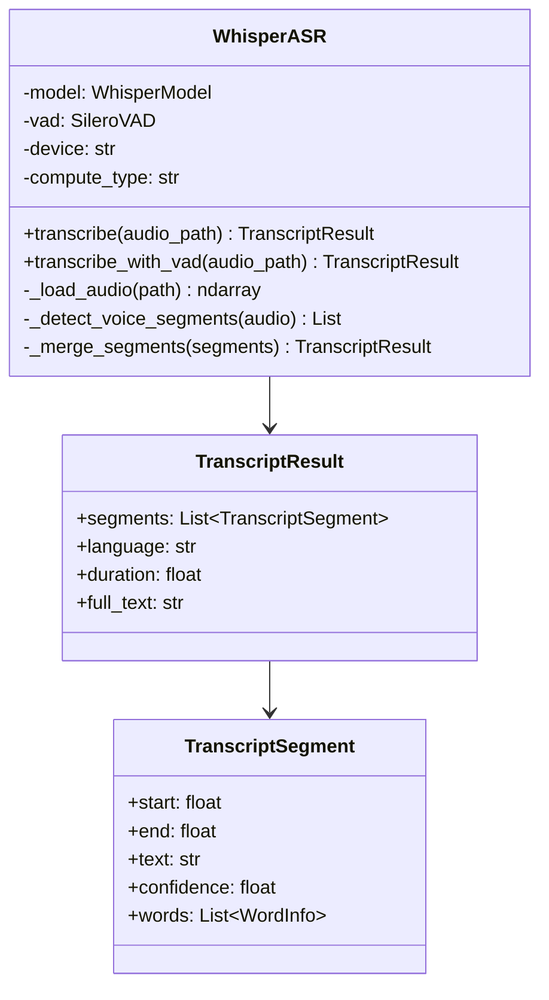

---

## 11. Anti-Hallucination Architecture (Chapter 4 - fig:anti_hallucination)

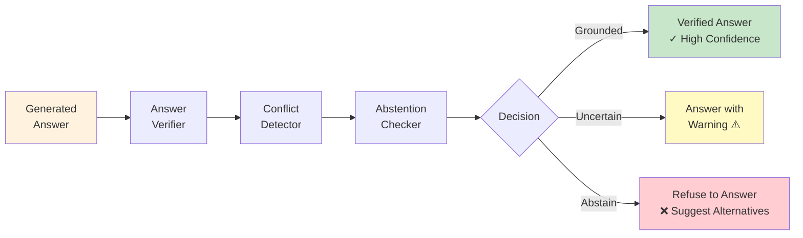

---

## 12. Chunking Module Class Diagram (Chapter 4 - fig:chunking_class)

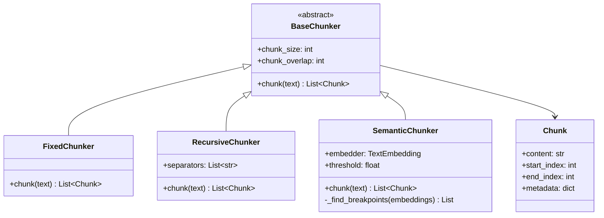

---

## 13. Qdrant Collection Schema (Chapter 4 - fig:qdrant_schema)

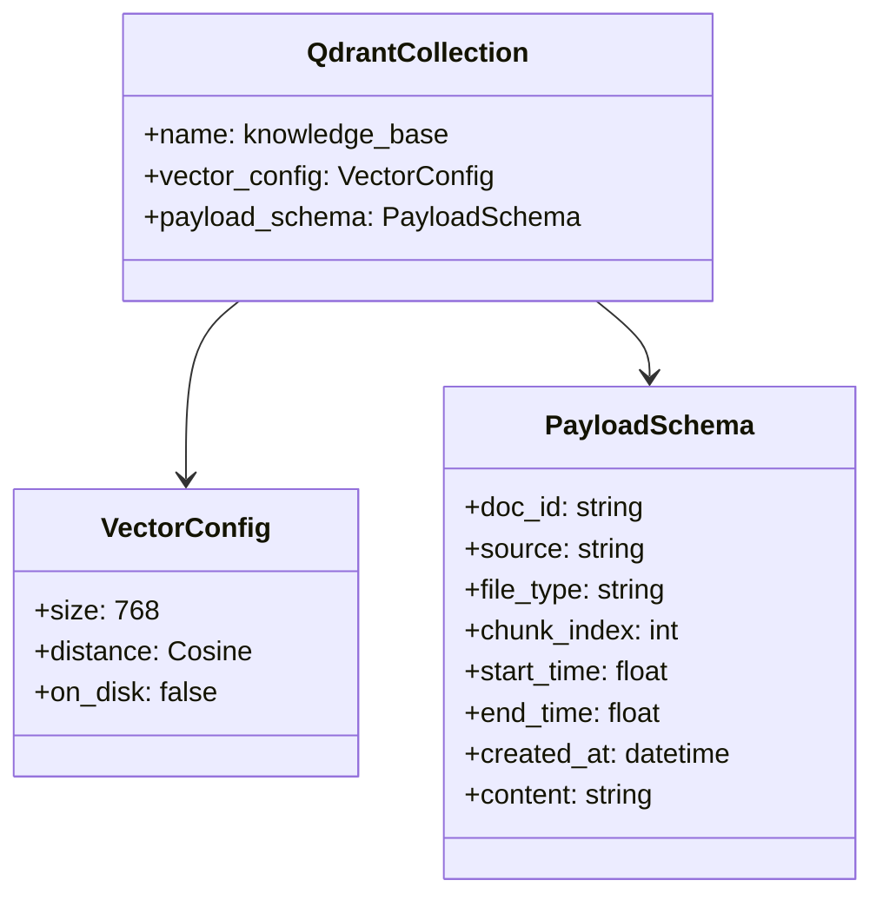

---

## 14. Student Portal Layout (Chapter 4 - fig:student_wireframe)

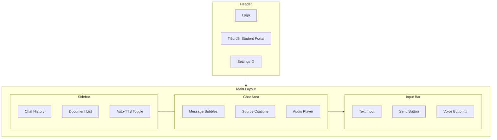

---

## 15. Admin Portal Layout (Chapter 4 - fig:admin_wireframe)

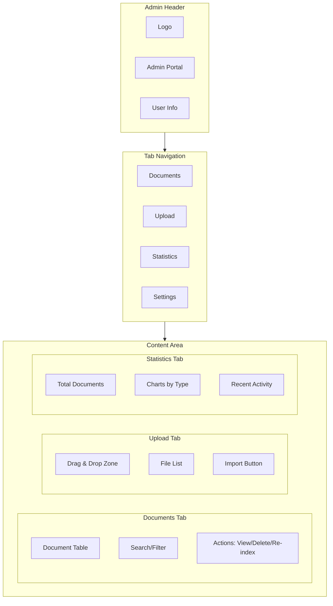

---

## 16. Two-Step Pipeline Overview (Bonus)

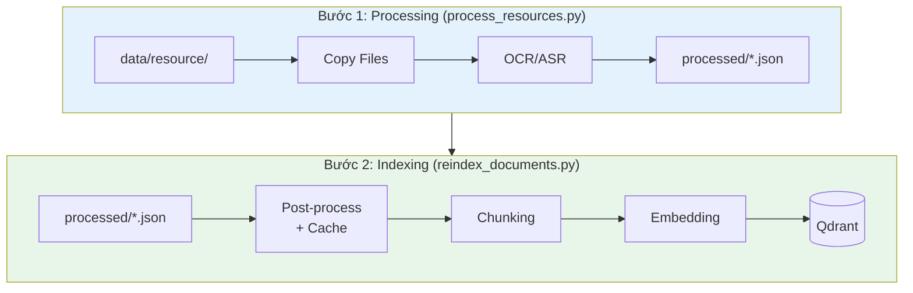

---

## 17. Tech Stack Layers (Chapter 3 - fig:tech_stack_layers)

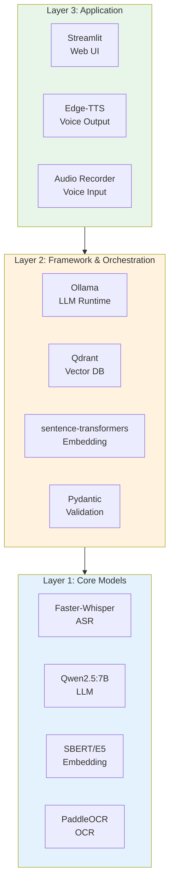

---

## Hướng dẫn sử dụng

1. **Mermaid Live Editor**: https://mermaid.live
   - Copy paste code Mermaid vào editor
   - Export PNG/SVG

2. **VS Code Extension**: "Mermaid Markdown Syntax Highlighting"
   - Preview trực tiếp trong VS Code

3. **Draw.io**: https://draw.io
   - Import Mermaid code hoặc vẽ lại đẹp hơn

4. **Kích thước khuyến nghị**:
   - Sơ đồ ngang: width 0.9\textwidth
   - Sơ đồ dọc: width 0.7-0.8\textwidth
   - Class diagram: width 0.85\textwidth

### Objective dataflow
%%{init: {'theme': 'base', 'themeVariables': { 'fontSize': '12px', 'fontFamily': 'Arial'}}}%%
flowchart TB
    %% ========== ROW 1: IMPORT PIPELINE ==========
    subgraph ROW1["📥 IMPORT PIPELINE"]
        direction LR
        A1["🎵 Audio/Video"] --> B1["ASR+VAD"]
        A2["📄 Documents"] --> B2["OCR"]
        B1 --> B3["Post-Process"]
        B2 --> B3
        B3 --> C1["Chunking"] --> C2["Embedding"] --> DB[("💾 VectorDB")]
    end

    %% ========== ROW 2: QUERY PIPELINE ==========
    subgraph ROW2["🔍 QUERY PIPELINE"]
        direction LR
        Q1["🎤 Query"] --> D1["Hybrid Search"] --> D2["Rerank"] --> D3["LLM"]
        D3 --> E1["Verify"] --> E2["Resolve"] --> E3["Abstain"] --> F1["🔊 Response"]
    end

    %% ========== CROSS-ROW CONNECTION ==========
    DB -.->|retrieval| D1

    %% ========== STYLING ==========
    style ROW1 fill:#E8F5E9,stroke:#4CAF50,stroke-width:2px
    style ROW2 fill:#E3F2FD,stroke:#2196F3,stroke-width:2px
    style DB fill:#FFE0B2,stroke:#FF9800,stroke-width:2px

    style A1 fill:#C8E6C9,stroke:#388E3C
    style A2 fill:#C8E6C9,stroke:#388E3C
    style B1 fill:#BBDEFB,stroke:#1976D2
    style B2 fill:#BBDEFB,stroke:#1976D2
    style B3 fill:#BBDEFB,stroke:#1976D2
    style C1 fill:#FFF59D,stroke:#FBC02D
    style C2 fill:#FFF59D,stroke:#FBC02D

    style Q1 fill:#B2EBF2,stroke:#0097A7
    style D1 fill:#E1BEE7,stroke:#7B1FA2
    style D2 fill:#E1BEE7,stroke:#7B1FA2
    style D3 fill:#E1BEE7,stroke:#7B1FA2
    style E1 fill:#FFCDD2,stroke:#D32F2F
    style E2 fill:#FFCDD2,stroke:#D32F2F
    style E3 fill:#FFCDD2,stroke:#D32F2F
    style F1 fill:#A5D6A7,stroke:#388E3C
