# Sơ đồ PlantUML cho Báo cáo ĐACN

Render tại: https://www.plantuml.com/plantuml/uml hoặc VS Code extension "PlantUML"

---

## 1. Quy trình ASR truyền thống (fig:asr_pipeline)

```plantuml
@startuml asr_pipeline
!theme cerulean
skinparam rectangleBorderColor #2196F3
skinparam rectangleBackgroundColor #E3F2FD

rectangle "Tín hiệu\nâm thanh" as input #E1F5FE
rectangle "Tiền xử lý\ntín hiệu" as preprocess
rectangle "Trích xuất\nđặc trưng\n(MFCC)" as feature
rectangle "Mô hình\nâm học" as acoustic
rectangle "Mô hình\nngôn ngữ" as language
rectangle "Giải mã\n(Decoding)" as decode
rectangle "Văn bản" as output #C8E6C9

input --> preprocess
preprocess --> feature
feature --> acoustic
acoustic --> language
language --> decode
decode --> output

@enduml
```



---

## 2. Kiến trúc RAG (fig:rag_architecture)

```plantuml
@startuml rag_architecture
!theme cerulean
skinparam packageBackgroundColor #FFFDE7

package "Giai đoạn Indexing (Offline)" {
    [Documents] as docs
    [Chunking] as chunk
    [Embedding] as embed
    database "Vector DB" as vdb

    docs --> chunk
    chunk --> embed
    embed --> vdb
}

package "Giai đoạn Query (Online)" {
    [Câu hỏi] as query #E1F5FE
    [Query Embedding] as qembed
    [Vector Search] as vsearch
    [Top-K Documents] as topk
    [Prompt Construction] as prompt
    [LLM] as llm
    [Câu trả lời\ncó nguồn] as answer #C8E6C9

    query --> qembed
    qembed --> vsearch
    vdb --> vsearch
    vsearch --> topk
    topk --> prompt
    prompt --> llm
    llm --> answer
}

@enduml
```



---

## 3. Kiến trúc tổng thể hệ thống (fig:system_architecture)


---

## 4. Pipeline Processing - Bước 1 (fig:processing_pipeline)

```plantuml
@startuml processing_pipeline
!theme cerulean

start
:Input Files\ndata/resource/;
#E1F5FE

:Phát hiện loại file;

switch (File Type?)
case (Audio/Video)
    :ASR Module\nFaster-Whisper;
case (PDF/Image)
    :OCR Engine\nPaddleOCR;
case (Text/Office)
    :Text Extractor\nPyMuPDF, docx;
endswitch

:RAW Content;

:Save to\nprocessed/*.json;
#C8E6C9

stop

@enduml
```

---

## 5. Pipeline Indexing - Bước 2 (fig:indexing_pipeline)

```plantuml
@startuml indexing_pipeline
!theme cerulean

start
:RAW Content\nprocessed/*.json;
#FFF3E0

:Post-Process\nLLM Correction;

if (Cache Hit?) then (yes)
    :Load from Cache;
else (no)
    :Process & Save to Cache;
endif

:Chunking\n(Semantic/Recursive/Fixed);

:Embedding\nSBERT/E5;

:Upload to Qdrant;
#C8E6C9

stop

@enduml
```

---

## 6. Query Pipeline (fig:query_pipeline)

```plantuml
@startuml query_pipeline
!theme cerulean
left to right direction

rectangle "Input" {
    (Text Input) as text
    (Voice Input 🎤) as voice #E1F5FE
}

rectangle "Processing" {
    (ASR) as asr
    (Query Expansion) as qe
    (Hybrid Search\nVector + BM25) as hs
    (Reranking) as rr
    (Conflict Detection) as cd
    (RAG Generation) as rag
    (Answer Verification) as av
}

rectangle "Output" {
    (Final Answer) as ans #C8E6C9
    (TTS 🔊) as tts #FFF3E0
}

voice --> asr
asr --> qe
text --> qe
qe --> hs
hs --> rr
rr --> cd
cd --> rag
rag --> av
av --> ans
ans --> tts

@enduml
```



---

## 7. Anti-Hallucination Architecture (fig:anti_hallucination)

```plantuml
@startuml anti_hallucination
!theme cerulean

rectangle "Generated Answer" as input #FFF3E0

rectangle "Answer Verifier" as verifier {
    :Check grounding\nin sources;
}

rectangle "Conflict Detector" as conflict {
    :Find contradictions\nbetween sources;
}

rectangle "Abstention Checker" as abstention {
    :Evaluate confidence\nand coverage;
}

diamond "Decision" as decision

rectangle "✓ Verified Answer\nHigh Confidence" as verified #C8E6C9
rectangle "⚠️ Answer with\nWarning" as warning #FFF9C4
rectangle "❌ Refuse to Answer\nSuggest Alternatives" as refuse #FFCDD2

input --> verifier
verifier --> conflict
conflict --> abstention
abstention --> decision

decision --> verified : Grounded
decision --> warning : Uncertain
decision --> refuse : Abstain

@enduml
```

---

## 8. ASR Module Class Diagram (fig:asr_class)


---

## 9. Chunking Module Class Diagram (fig:chunking_class)


---

## 10. Qdrant Collection Schema (fig:qdrant_schema)


---

## 11. Two-Step Pipeline Overview (Bonus)

```plantuml
@startuml two_step_pipeline
!theme cerulean

package "Bước 1: Processing\n(process_resources.py)" #E3F2FD {
    folder "data/resource/" as input
    [Copy Files] as copy
    [OCR/ASR] as process
    file "processed/*.json" as json

    input --> copy
    copy --> process
    process --> json
}

package "Bước 2: Indexing\n(reindex_documents.py)" #E8F5E9 {
    [Post-process\n+ Cache] as postproc
    [Chunking] as chunk
    [Embedding] as embed
    database "Qdrant" as qdrant

    json --> postproc
    postproc --> chunk
    chunk --> embed
    embed --> qdrant
}

note bottom of json
  Tách riêng để tái sử dụng
  khi thay đổi cấu hình indexing
end note

@enduml
```



---

## 12. Hybrid Search Flow (Bonus)

```plantuml
@startuml hybrid_search
!theme cerulean

start
:Query;

fork
    :Vector Search\n(Semantic);
    :Get ranked results\nby cosine similarity;
fork again
    :BM25 Search\n(Keyword);
    :Get ranked results\nby term frequency;
end fork

:Reciprocal Rank Fusion\nRRF(d) = Σ 1/(k + rank);

:Combined ranked list;

:Reranking\n(Cross-Encoder);

:Final Top-K results;
#C8E6C9

stop

@enduml
```

---

## 13. Voice Input Flow (Bonus)


---

## Hướng dẫn sử dụng

### Online Renderer
- **PlantUML Server**: https://www.plantuml.com/plantuml/uml
- Copy code (không bao gồm markdown fence)
- Nhấn Submit để render
- Download PNG/SVG

### VS Code
1. Cài extension "PlantUML"
2. Cài Java Runtime (JRE)
3. Tạo file `.puml` với code
4. Alt+D để preview

### Export cho LaTeX
```latex
\begin{figure}[H]
    \centering
    \includegraphics[width=0.9\textwidth]{images/diagram_name.png}
    \caption{Caption text}
    \label{fig:label}
\end{figure}
```

### Kích thước khuyến nghị
- Flowchart: 0.9\textwidth
- Class diagram: 0.85\textwidth
- Sequence diagram: 0.8\textwidth

